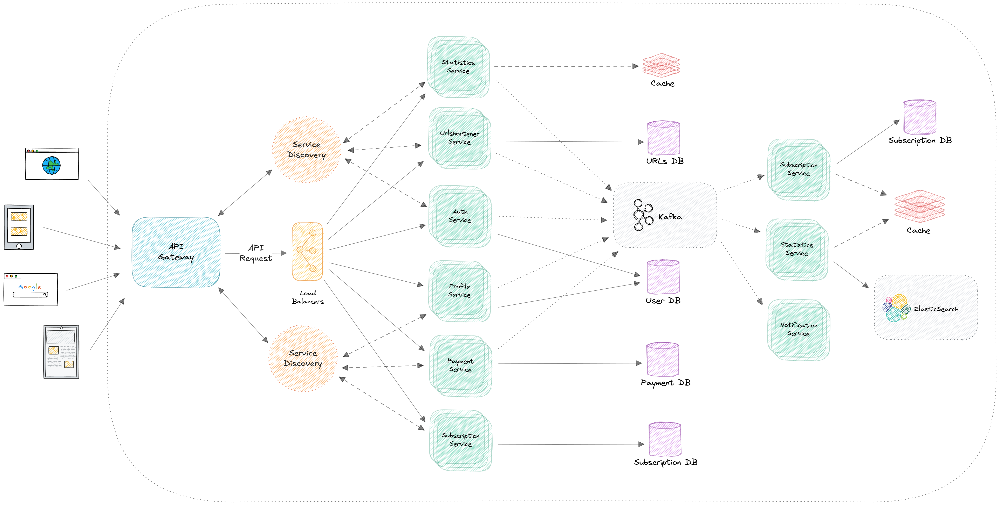

# cmpct

## Introduction

`cmpct` is a modern URL shortening platform designed to offer a seamless and efficient way to manage your links. The project features a user-friendly frontend hosted live at [https://ui.cmpct.xyz](https://ui.cmpct.xyz/), ensuring an intuitive experience for users. Leveraging a diverse tech stack that includes React.js with TypeScript for the GUI, and robust backend services built with Java (Spring Boot), Node.js, and GoLang, `cmpct` delivers high performance with enhanced security and scalability.

## Features

- **Email Login/Signup:**
  Users can easily register and log in using their email, providing a simple yet secure way to access the platform.

- **Google and GitHub OAuth Login:**
  Enjoy a streamlined authentication process by signing in through popular OAuth providers like `Google` and `GitHub`.

- **Dynamic Dashboard:**
  Access a powerful dashboard that visualizes key metrics such as geographical distribution, device usage, and top-performing URLs, along with a week-long data view for URL clicks.

- **Custom Alias for Short URLs:**
  Create personalized short URLs with custom aliases, available based on your active subscription plan.

- **Subscription Plan-Based Access:**
  Unlock additional features and higher resource limits by subscribing to tailored plans, ensuring flexibility based on user needs.

- **PayPal Payment Gateway Integration:**
  Experience smooth and secure transactions through integrated PayPal payment processing.

- **Profile Management:**
  Easily update your personal details and manage account settings through an intuitive profile interface.

- **Subscription and Payment History:**
  Keep track of your subscription packs and payment transactions with a detailed history log.

## High-Level Architecture

### Architecture Diagram

The overall architecture of cmpct is depicted in the diagram below. This diagram illustrates the interaction between the frontend, the various microservices, and the supporting systems like caching, authentication, and event streaming.


_High Level Architecture Diagram of `cmpct`._

### Microservices Overview

1. **API Gateway**

   - **Tech Stack:**
     Spring Cloud API Gateway, Spring Security, Redis

   - **Description:**
     Acts as the entry point to the application. All backend requests are routed through it; based on the requested resource, it load balances the requests and forwards them to the respective microservice after performing rate limiting checks. It also handles user authentication via JWT tokens.

   - **Repository:** [API Gateway Repo](https://github.com/akgarg0472/url-shortener-apigateway)

2. **URL Shortener Auth Service**

   - **Tech Stack:**
     GoLang, MySQL, Kafka

   - **Description:**
     Manages authentication and authorization tasks, including JWT token generation/validation, handling OAuth callbacks, and orchestrating the password reset pipeline from initiation to completion.

   - **Repository:** [URL Shortener Auth Service Repo](https://github.com/akgarg0472/url-shortener-authservice)
   - **Java SDK:** [AuthService Java Client](https://github.com/akgarg0472/authservice-java-client)

3. **URL Shortener Service**

   - **Tech Stack:**
     Spring Boot, MongoDB, Kafka

   - **Description:**
     Responsible for creating short URLs and retrieving the original URLs. It plays a crucial role in ensuring quick redirections and efficient URL management.

   - **Repository:** [URL Shortener Service Repo](https://github.com/akgarg0472/urlshortener)

4. **URL Shortener Statistics Service**

   - **Tech Stack:**
     Node.js with TypeScript & Express, Kafka, ElasticSearch, Redis

   - **Description:**
     Handles the storage and retrieval of metrics data. It exposes REST endpoints to query various data sets from ElasticSearch and leverages Kafka to receive real-time metrics from URL shortener service instances.

   - **Repository:** [URL Shortener Statistics Service Repo](https://github.com/akgarg0472/url-shortener-statisticsservice)

5. **URL Shortener Subscription Service**

   - **Tech Stack:**
     Spring Boot, MySQL, Kafka, Redis

   - **Description:**
     Manages user subscription data using MySQL for persistent storage and Redis for caching. It also uses Kafka for event streaming to keep other services updated with subscription events.

   - **Repository:** [URL Shortener Subscription Service Repo](https://github.com/akgarg0472/urlshortener-subs-service)

6. **URL Shortener Payment Service**

   - **Tech Stack:**
     Spring Boot, MySQL, Kafka, Redis, PayPal

   - **Description:**
     Oversees the payment process from order creation to final payment settlement. It utilizes Redis for caching, MySQL for data persistence, and Kafka for event streaming. Currently integrated with PayPal, it offers flexibility for future expansion to additional payment gateways.

   - **Repository:** [URL Shortener Payment Service Repo](https://github.com/akgarg0472/urlshortener-payment-service)

7. **URL Shortener Profile Service**

   - **Tech Stack:**
     Spring Boot, MySQL, Kafka

   - **Description:**
     Manages user profile data and ensures seamless integration with other services such as the notification service via Kafka event streaming. Data is securely stored in MySQL.

   - **Repository:** [URL Shortener Profile Service Repo](https://github.com/akgarg0472/urlshortener-profileservice)

8. **URL Shortener Notification Service**

   - **Tech Stack:**
     Node.js with TypeScript, Kafka, Google SMTP

   - **Description:**
     Responsible for sending notifications to users, primarily through email using Google SMTP. It ensures timely delivery of alerts and updates across the platform.

   - **Repository:** [URL Shortener Notification Service Repo](https://github.com/akgarg0472/urlshortener-notification-service)

### Metrics & Monitoring

- **Metrics Collection:**
  Each microservice collects performance and operational metrics using Prometheus. A centralized Prometheus configuration file is provided in the [prometheus](./prometheus) directory to streamline setup and ensure consistent monitoring across all services.

- **Visualization:**
  The collected metrics are aggregated and visualized on Grafana dashboards, offering real-time insights into the system's performance and health. Pre-configured Grafana dashboard JSON files are available in the [grafana-dashboards](./grafana-dashboards) directory, enabling quick deployment and easy customization of monitoring views.

## System Requirements

To run `cmpct` locally, we recommend the following minimum specifications:

- **CPU:** Quad-core processor (4+ cores)
- **Memory:** 8 GB RAM (16 GB or more recommended)
- **Disk Space:** At least 20 GB of free space
- **Operating System:** Linux, macOS, or Windows (with Docker support)
- **Software:** Latest versions of Docker and Docker Compose, along with Git

If your system does not meet these requirements, you can always try the live version of cmpct at [https://ui.cmpct.xyz/](https://ui.cmpct.xyz/).

## Installation & Setup

Follow these steps to get the entire cmpct system up and running quickly:

1. **Clone the Repository:**
   Clone the main repository to your local machine:
   ```bash
   git clone https://github.com/akgarg0472/cmpct.git
   ```
2. **Navigate to the Docker Compose Directory:**
   Change to the [docker-compose](./docker-compose/) containing the Docker Compose file and the environment configuration files:

   ```bash
   cd docker-compose
   ```

3. **Configure Environment:**
   Ensure you have set up the required environment variables. Review the provided `.env` files in this directory and update them with your configuration details if required.

   Run the following command to create the required directories for storing container logs and data:

   ```bash
   mkdir -p /tmp/urlshortener/data/{mysql,mongo,elastic,redis,kafka} /tmp/urlshortener/logs
   ```

4. **Start the System:**
   Execute the following command to build and launch all services:

   ```bash
   docker compose up -d
   ```

   This command will start all microservices as defined in the Docker Compose file, bringing the entire system up with minimal hassle.

5. **Verify the Setup:**
   To confirm that all services are running as expected, check the logs with:

   ```bash
   docker compose logs -f
   ```

   You should see the various services initializing and running.

   Alternatively, if you want to track the resource usage (such as CPU and memory consumption) of the containers managed by Docker Compose, run:

   ```bash
   docker compose stats
   ```

   This command provides a live overview of the resource utilization for each container in the composition. Make sure to run this command from within the directory that contains your `docker-compose.yml` file for accurate results.

   ### Tips:

   - If the logs seem overwhelming or difficult to read, you can filter the logs for a specific service by adding the service name at the end of the command, like this:

     ```bash
     docker compose logs -f <service-name>
     ```

   - You can also combine the docker-compose logs command with grep to search for specific keywords, such as `errors`:

     ```bash
     docker compose logs -f <service-name> | grep 'error'
     ```

   Once the services are up, you can access the frontend at `http://localhost:3000` and explore the cmpct platform.

**Note:** Detailed installation and setup instructions for individual microservices are available in their respective repositories.

## Design Documents & Figma Designs

For historical reference, the initial Figma design is provided below. Although it represents the early wireframing stage and is no longer current, it serves as proof of the project's early planning efforts.

- **Initial Figma Design:**
  [URL Shortener](https://www.figma.com/design/8nxQBr3qd3zje2NpBFveI2/URL-Shortener?node-id=208-2&t=hzJWsDAubVW7SRek-1)

  _Note: This design was created during the project's initial stage and is provided here for reference purposes only._

## License

`cmpct` is open source and licensed under the [AGPL 3.0 License](./LICENSE). This license applies to all components of the project, including backend services, frontend code, and associated documentation.

## Contribution

We welcome contributions to `cmpct`! Whether you're fixing bugs, adding new features, or improving documentation, your help is greatly appreciated. To contribute, please follow these guidelines:

1. **Fork the Repository:**
   Create your own fork of the repository and clone it locally.

2. **Create a Feature Branch:**
   Use a descriptive name for your branch:
   ```bash
   git checkout -b feature/your-feature-name
   ```
3. **Make Your Changes:**
   Ensure your code follows our coding standards and is well-documented.

4. **Run Tests:**
   Verify that all existing tests pass and add new tests if necessary.

5. **Submit a Pull Request:**
   Once your changes are ready, push your branch and open a pull request. Please provide a clear description of your changes and the problem they address.

6. **Review Process:**
   Your pull request will be reviewed by our maintainers. Feedback may be provided—please address any comments before merging.

For detailed contribution guidelines and coding standards, please refer to the respective documentation in each microservice repository.
